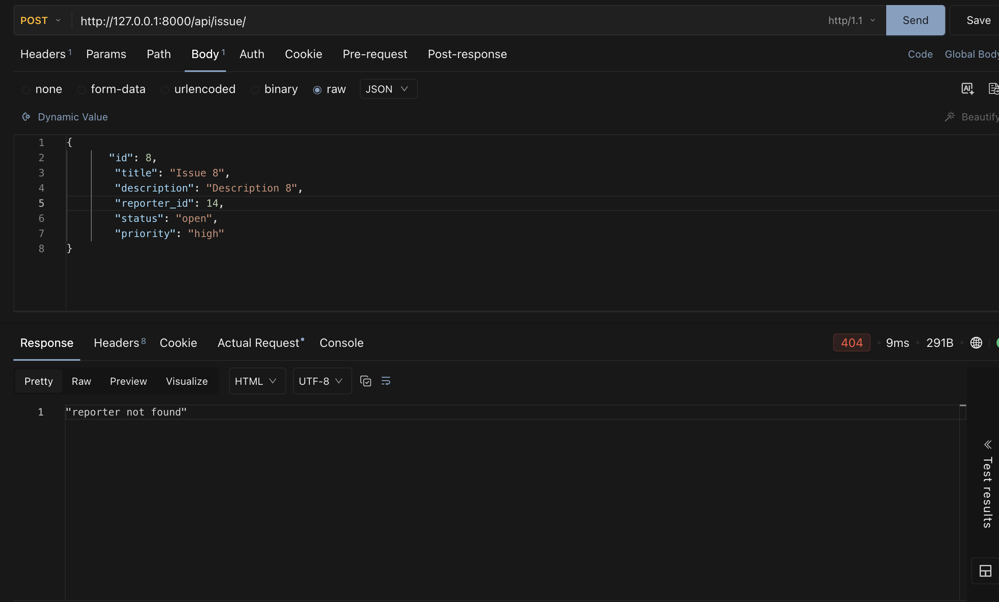

# DevTrack

DevTrack is a Django-based backend API for tracking engineering issues and their reporters.

The project demonstrates object-oriented programming concepts such as abstraction, inheritance, method overriding, and polymorphism while using JSON files for data persistence.

---

## Features

- Create and retrieve reporters
- Create and retrieve engineering issues
- Retrieve issues by ID
- Filter issues by status
- Validate reporter and issue data
- Associate issues with existing reporters
- Use different Issue subclasses based on priority
- Persist data using JSON files
- Return appropriate HTTP status codes for successful and failed requests

---

## Tech Stack

- Python
- Django
- JSON
- Object-Oriented Programming

---

## Project Structure

```text
devtracker/
├── devtrack/
│   ├── settings.py
│   ├── urls.py
│   └── ...
├── issues/
│   ├── models.py
│   ├── views.py
│   ├── urls.py
│   ├── issues.json
│   └── reporters.json
├── manage.py
├── requirements.txt
└── README.md

Setup and Running the Project
1. Clone the repository
git clone https://github.com/suryaps96/airtribe_django_classes
cd devtracker

Replace https://github.com/suryaps96/airtribe_django_classes with the URL of the GitHub repository.
2. Create a virtual environment
python3 -m venv .venv

3. Activate the virtual environment
On macOS/Linux:
source .venv/bin/activate

On Windows:
.venv\Scripts\activate

4. Install dependencies
pip install -r requirements.txt

5. Run the Django development server
python manage.py runserver

The API will be available at:
http://127.0.0.1:8000/

API Endpoints
Reporters
Create a Reporter
POST /api/reporters/

Creates a new reporter after validating the reporter's name and email.
Example request:
{
    "id": 1,
    "name": "John Doe",
    "email": "john.doe@example.com",
    "team": "Engineering"
}

Successful response:
201 Created

Get All Reporters
GET /api/reporters/

Returns all reporters stored in reporters.json.
Successful response:
200 OK

Get Reporter by ID
GET /api/reporters/?id=1

Returns the reporter with the specified ID.
If the reporter does not exist, the API returns:
404 Not Found

Issues
Create an Issue
POST /api/issues/

Creates a new issue after validating the request and verifying that the referenced reporter exists.
Example request:
{
    "id": 1,
    "title": "Login button broken",
    "description": "Users cannot click the login button",
    "reporter_id": 1,
    "status": "open",
    "priority": "critical"
}

Successful response:
201 Created

The response also contains a priority-specific message generated by the Issue object's describe() method.
Issue Subclass Selection
The Issue subclass is selected based on the supplied priority:
Priority	Class
critical	CriticalIssue
low	LowPriorityIssue
medium	Issue
high	Issue


Get All Issues
GET /api/issues/

Returns all issues stored in issues.json.
Successful response:
200 OK

Get Issue by ID
GET /api/issues/?id=1

Returns the issue with the specified ID.
If the issue does not exist:
404 Not Found

Filter Issues by Status
GET /api/issues/?status=open

Returns all issues whose status matches the requested status.
Supported issue statuses:
- open
- in_progress
- resolved
- closed
Object-Oriented Design
The project uses the following class hierarchy:
BaseEntity
├── Reporter
└── Issue
    ├── CriticalIssue
    └── LowPriorityIssue

BaseEntity
BaseEntity is an abstract base class that defines the common interface for the application's entities.
It requires child classes to implement:
- validate()
- to_dict()
to_dict() converts an object's instance attributes into a dictionary using self.__dict__.
Reporter
Reporter inherits from BaseEntity.
Reporter validation includes:
- Name must not be empty
- Email must contain @
Issue
Issue inherits from BaseEntity.
Issue validation includes:
- Title must not be empty
- Description must not be empty
- Reporter ID must be provided
- Status must be one of the supported statuses
- Priority must be one of the supported priorities
CriticalIssue and LowPriorityIssue
CriticalIssue and LowPriorityIssue inherit from Issue.
They override the describe() method to provide priority-specific descriptions.
The API dynamically selects the appropriate subclass based on the issue priority.
This demonstrates polymorphism because the API can call:
item.describe()


without needing to know whether item is an Issue, CriticalIssue, or LowPriorityIssue.
Data Storage
This project uses JSON files for persistence instead of Django's ORM/database.
The two JSON files are:
issues/issues.json
issues/reporters.json

The application follows this pattern when modifying stored data:
Read JSON
   ↓
Convert to Python objects/data
   ↓
Modify the data
   ↓
Write the updated data back to JSON

This approach was used because the assignment specifically requires JSON-based persistence.
Design Decisions
JSON File Storage
JSON files were used instead of Django's ORM because JSON persistence is explicitly required by the assignment.
The application reads the existing JSON data into Python, modifies the data, and writes the updated list back to the JSON file.
Entity Validation vs Relationship Validation
Validation responsibilities are separated between the OOP classes and the API layer.
Entity-level validation is handled by the classes themselves.
For example:
Reporter.validate()Issue.validate()


These methods validate the object's own data.
The API layer handles relationship validation, such as verifying that an issue's reporter_id corresponds to an existing reporter.
This keeps the entity validation separate from validation involving relationships between entities.
HTTP Status Codes
The API uses HTTP status codes to communicate the result of each request.
Status Code	Meaning
200	Successful GET request
201	Resource successfully created
400	Validation error / invalid request
404	Requested resource or reporter not found


Error Handling
Validation errors raised by the OOP classes are caught by the API layer and converted into HTTP 400 Bad Request responses.
Example:
{
    "error": "Name cannot be empty"
}

If an issue references a reporter that does not exist, the API returns a 404 Not Found response.
Testing
The API was tested for the following scenarios:
Reporter
- Get all reporters
- Get reporter by valid ID
- Get reporter by invalid ID
- Create a valid reporter
- Reject reporter with an empty name
- Reject reporter with an invalid email
- Verify invalid reporters are not persisted
Issues
- Get all issues
- Get issue by valid ID
- Get issue by invalid ID
- Filter issues by status
- Create critical priority issue
- Create low priority issue
- Create medium priority issue
- Create high priority issue
- Reject invalid title
- Reject invalid status
- Reject invalid priority
- Reject issues referencing a non-existent reporter
- Verify valid issues are persisted
- Verify invalid issues are not persisted
- Verify persisted data survives a Django server restart
API Test Screenshots
Successful Request
Add your successful API request screenshot here.
Example:


Failed Request
Add your failed API request screenshot here.
Example:


Running Tests Manually
The API can be tested using Postman or another HTTP client.
Start the Django server:
python manage.py runserver

Then send requests to:
http://127.0.0.1:8000/api/

Conclusion
DevTrack demonstrates a simple Django backend using object-oriented design and JSON-based persistence.
The project combines Django request handling with Python OOP concepts including abstraction, inheritance, method overriding, validation, and polymorphism.
